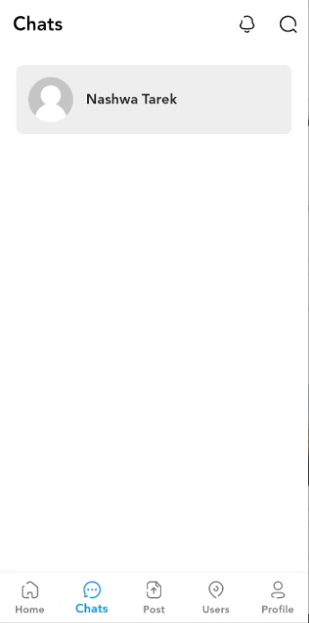

# Social App

# General Description

Flutter-based Social application which allows users to share posts, view news feed, connect with
friends by
chatting, and manage their profiles.

# Connect App to Firebase

Services used is **Firebase auth**, **Cloud firestore**, **Storage**, and **Messaging**.

- The app manages authentication of users using firebase auth.
- The app saves posts and users data in firestore.
- Also, it handles uploading and downloading images from firebase storage.
- The chat feature uses firebase messaging for real-time communication between users.

Project configuration with firebase:

- First, create a firebase project.
- Connect my app to firebase manually and add google-services.json file.
- Then, we add firebase core, firebase_auth, cloud_firestore, firebase_storage, firebase_messaging
  packages to the pubspec.yaml file.

And initialize firebase in main.dart file.

----------------------------------

## Pages & Features

### 1. Authentication

- *Signup Page*:
    - **Input fields**: Name, Email, Password, Confirm Password, and Phone Number.
    - Users are redirected to the Home Page after signup successfully.

- *Login Page*:
    - Input fields: Email, Password.
    - **Validation**: Checks credentials using firebase auth.
    - **Navigation**: Successful login redirects users to the **Home Page**.
    - **Features**: Login using Google feature provided using firebase and google sign in package.
    - The user token saved locally after login.

### 2. Bottom Navigation Bar

- Visible on main pages: **Home**, **Chats**, **Post**, **Users**, **Profile**.
- Includes icons for easy navigation using custom icons (Icon Broken file in styles folder).

### 3. Home Page

- **Posts List View**: Displays vertically scrollable List of cards for showing posts of users which
  saved in firestore.
    - Each post card includes:
        - Image of the user's post.
        - User Name.
        - Date of the post.
        - Post text.
        - post image if exist.
        - The number of likes, comments, and shares.

### 4. Chats Page Feature

- Displays a list of users who have a chat with the current user or the users which the current user
  can contact with.
- **Navigation**: Selecting a user navigates to a chat page for that user to send/receive messages.

### 5. Add Post Page

- Allows users to create new post then show it synchronously on the **Home Page**.
- **Features**: Adding post using text or/and image.

### 6. Users Page

- Displays a list of users registered in the application.

### 7. Profile Page

- Displays user details including:
    - Name
    - Profile Image
    - Cover image
    - bio
    - no of user posts
    - user's posts list.

- **Features**:
    - Edit profile feature.
    - Add photo/post feature.
    - Change settings includes theme feature.
      
### 8. Theme feature

- Allow manually toggle between light and dark modes.
- Using a switch in settings screen.
- Handled using social bloc.

### 9. Profile image Management

- Apply changing profile image feature.
- The user can change his image from Gallery or Camera.

------------------------------------

# State Management

- The application uses **BLoC/cubit State Management** to manage the state of the
  application.
- The controllers of the application are implemented in the controllers folder (in core folder).
  They are:
    - **Social Cubit**.
    - **Login Cubit**.
    - **Register Cubit**.
    - **Visit Profile Cubit**.

---------------------------------

# Files Architecture

The architecture of the project is divided into the following folders:

- core (components, controllers, constants, styles, and strings).
- layout (home layout including bottom navigation bar).
- models (user model, post model, message model).
- network (local folder: to save data locally using shared preferences).
- pages (login page, register page, home page, chats page, new post page, users page, profile page,
  edit profile page, edit post page, settings page).

-------------------------------------------

# UI Design

The application has a user-friendly UI.

# ScreenShots

| Home Page                    | Chats Page                 |
|------------------------------|----------------------------|
|   |  |

| Post Page                    | Profile Page                   |
|------------------------------|--------------------------------|
|  |  |

-------------------------------------------

# Packages used

## **flutter_bloc**

Provides state management for implementing BLoC (Business Logic Component).

- **Purpose**: Helps in managing and separating business logic from UI.
- **Documentation**: [flutter_bloc Documentation](https://pub.dev/packages/flutter_bloc)

## **Conditional-builder-null-safety**

- **Purpose**: Helps in creating conditional widgets based on a condition.
- **Documentation**: [conditional_builder_null_safety Documentation](https://pub.dev/packages/conditional_builder_null_safety)

## **hexcolor**

- **Purpose**: Helps in converting hex color codes to Color objects.
- **Documentation**: [hexcolor Documentation](https://pub.dev/packages/hexcolor)

## **fluttertoast**

- **Purpose**: Helps in displaying toast messages on the screen.
- **Documentation**: [fluttertoast Documentation](https://pub.dev/packages/fluttertoast)

## **shared_preferences**

- **Purpose**: Helps in storing and retrieving data locally.
- **Documentation**: [shared_preferences Documentation](https://pub.dev/packages/shared_preferences)

## ** carousel_slider**

- **Purpose**: Helps in creating a slider for displaying a list of images.
- **Documentation**: [carousel_slider Documentation](https://pub.dev/packages/carousel_slider)

## **basic_utils**

- **Purpose**: Helps in working with basic utilities.
- **Documentation**: [basic_utils Documentation](https://pub.dev/packages/basic_utils)

## **intl**

- **Purpose**: Helps in working with internationalization and formatting date.
- **Documentation**: [intl Documentation](https://pub.dev/packages/intl)

## **image_picker**

- **Purpose**: Helps in picking images from the device.
- **Documentation**: [image_picker Documentation](https://pub.dev/packages/image_picker)

## **cached_network_image**

- **Purpose**: Helps in efficiently loading and caching images from the network.
- **Documentation**: [cached_network_image Documentation](https://pub.dev/packages/cached_network_image)

## **google_sign_in**

- **Purpose**: Helps in authenticating users using Google sign-in.
- **Documentation**: [google_sign_in Documentation](https://pub.dev/packages/google_sign_in)

## **firebase_core**

- **Purpose**: Helps in initializing and configuring Firebase.
- **Documentation**: [firebase_core Documentation](https://pub.dev/packages/firebase_core)

## **cloud_firestore**

- **Purpose**: Helps in accessing and manipulating data in Firestore.
- **Documentation**: [cloud_firestore Documentation](https://pub.dev/packages/cloud_firestore)

## **firebase_auth**

- **Purpose**: Helps in authenticating users using Firebase Authentication.
- **Documentation**: [firebase_auth Documentation](https://pub.dev/packages/firebase_auth)

## **firebase_storage**

- **Purpose**: Helps in uploading and downloading files from Firebase Storage.
- **Documentation**: [firebase_storage Documentation](https://pub.dev/packages/firebase_storage)

## **firebase_messaging**

- **Purpose**: Helps in sending and receiving push notifications using Firebase Messaging.
- **Documentation**: [firebase_messaging Documentation](https://pub.dev/packages/firebase_messaging)
--------------------------------------------
